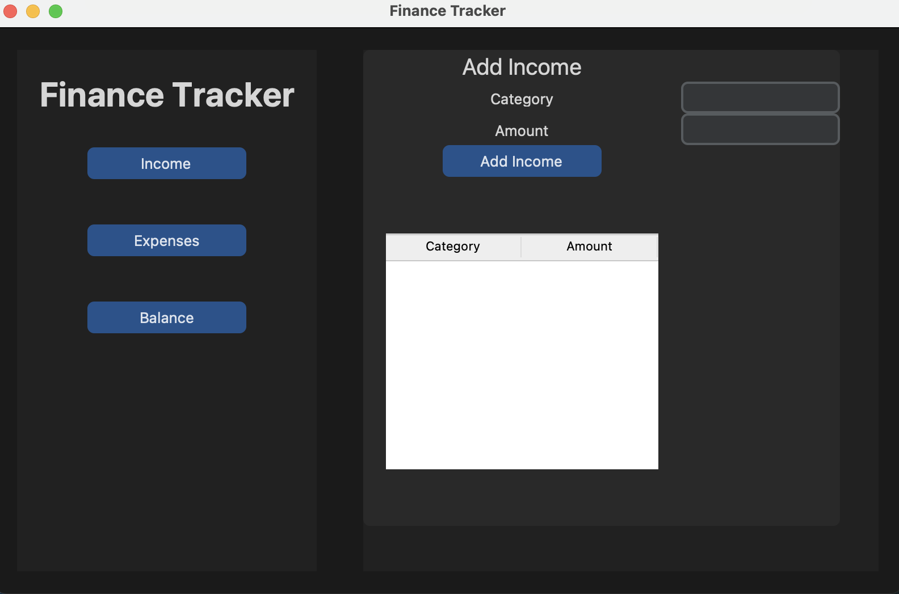
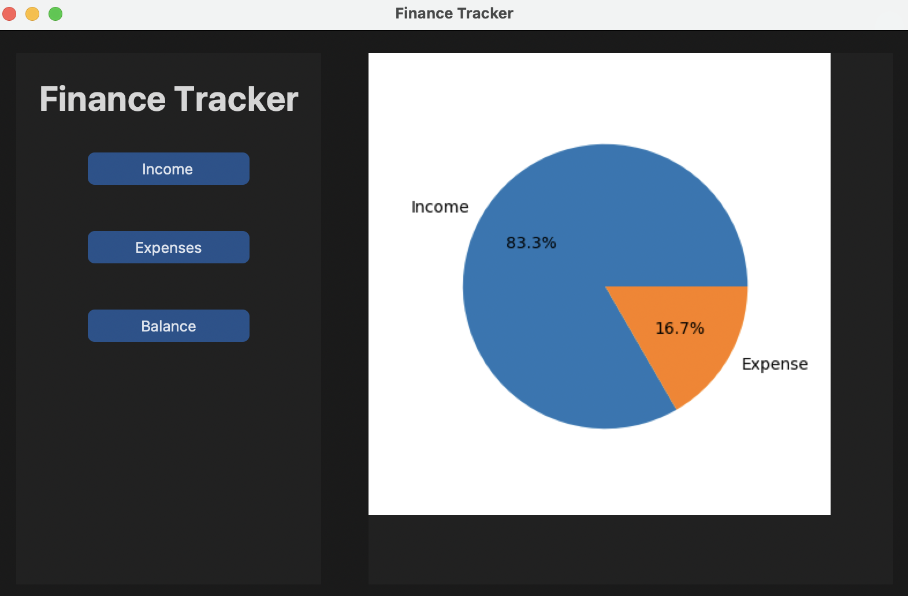
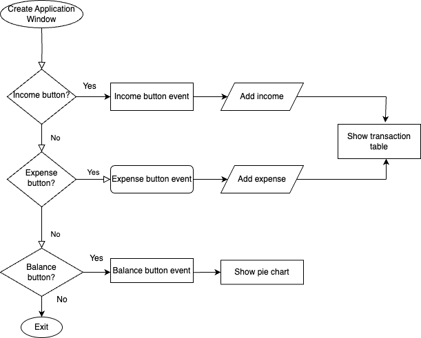

# Finance Tracker 📋

A finance tracker application built using Python's tkinter module. It allows the user to keep track of their income and expenses, and visualize their balance through a pie chart. 🥧📊
Utilizing **customtkinter** gives the application a visual edge over applications developed with tkinter only! 🎨

<p align="center">



## Prerequisites ⚙️

Before you begin, ensure you have met the following requirements:

You have installed the following python modules:

- `customtkinter`
- `matplotlib`

You can install these modules using pip:

```
pip install customtkinter matplotlib
```

### How to run the script 🚀

1. Go to the directory. https://github.com/Mabruk7/Finance-tracker.git

2. Run this command on Terminal.

```
python3 main.py
```

### Flowchart of the code 🤹‍♀️



## Moving Forward...🐾

This application serves as an excellent starting point for beginners. Its simplicity allows for easy understanding, yet it provides ample room for enhancement!
Beginner ➡️ Advanced

- Implement a database to persist user data. This addition will significantly improve the application's utility by allowing users to maintain their finance records across sessions.
- Migrate the application to a web-based platform using frameworks like Django or Flask. This shift would increase the accessibility of the application and provide opportunities to explore web development principles and practices.

## _Author Name_ 👩🏻‍💻

**Osman Mab-ruk Bawa**

[](https://github.com/mabruk7)
[](https://github.com/mabruk7?tab=repositories)
